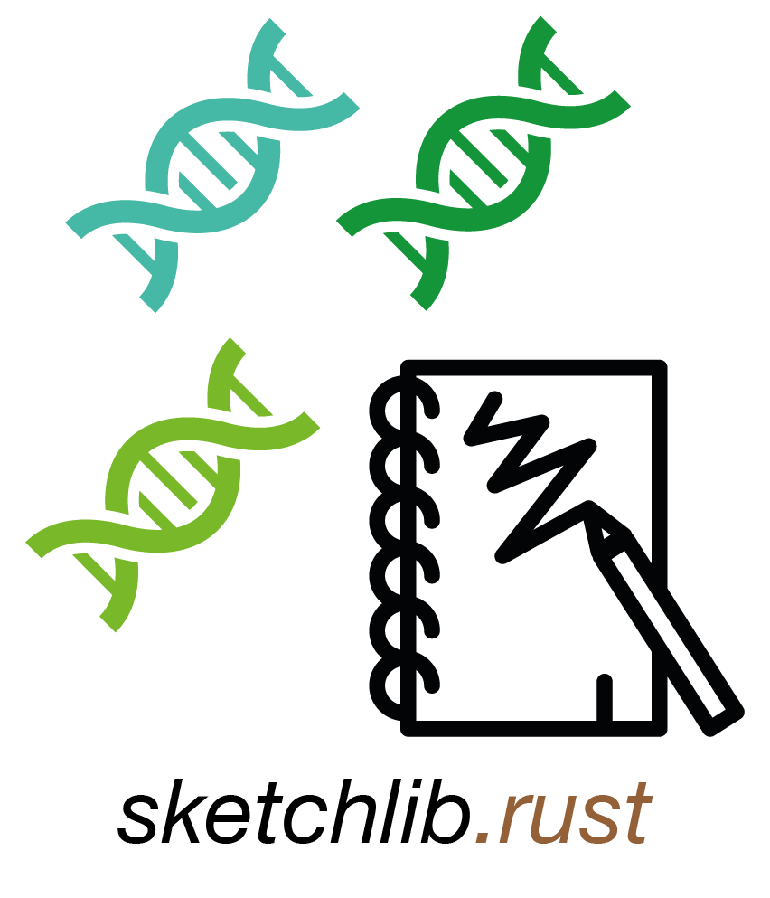

# sketchlib.rust 

<!-- badges: start -->
[](https://github.com/bacpop/sketchlib.rust/actions/workflows/ci.yml)
[](https://github.com/bacpop/sketchlib.rust/actions/workflows/clippy.yml)
[](https://docs.rs/sketchlib)
[](https://codecov.io/gh/bacpop/sketchlib.rust)
[](https://crates.io/crates/sketchlib)
[](https://github.com/bacpop/sketchlib.rust/releases)
<!-- badges: end -->

## Description

This is a reimplementation and extension of [pp-sketchlib](https://github.com/bacpop/pp-sketchlib)
in the rust language. This version is optimised for larger sample numbers, particularly
allowing subsets of samples to be compared.

v0.2.0 is the first stable release. We intend to keep the file format unchanged after this
point so sketch libraries will not need to be rebuilt.

### Citation

No preprint or paper yet, but we rely on algorithms from:

*bindash* (written by XiaoFei Zhao):\
Zhao, X. BinDash, software for fast genome distance estimation on a typical personal laptop.\
*Bioinformatics* **35**:671–673 (2019).\
doi:[10.1093/bioinformatics/bty651](https://dx.doi.org/10.1093/bioinformatics/bty651)

*ntHash* (written by Hamid Mohamadi):\
Mohamadi, H., Chu, J., Vandervalk, B. P. & Birol, I. ntHash: recursive nucleotide hashing.\
*Bioinformatics* **32**:3492–3494 (2016).\
doi:[10.1093/bioinformatics/btw397](https://dx.doi.org/10.1093/bioinformatics/btw397)

## Documentation

See https://docs.rs/sketchlib

## Installation

Choose from:

1. Download a binary from the releases.
2. Use `cargo install sketchlib` or `cargo add sketchlib`.
3. Build from source

For 2) or 3) you must have the rust toolchain installed.

### OS X users

If you have an M1-4 (arm64) Mac, we aren't currently automatically building binaries, so would recommend either option 2) or 3) for best performance.

If you get a message saying the binary isn't signed by Apple and can't be run, use the following command to bypass this:

```
xattr -d "com.apple.quarantine" ./sketchlib
```

### Build from source

1. Clone the repository with git clone.
2. Run `cargo install --path .` or `RUSTFLAGS="-C target-cpu=native" cargo install --path .` to optimise for your machine.
